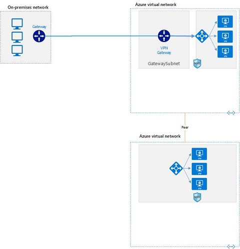

# Full lab deployment



What is currently deployed with the lab?

- [Full lab deployment](#full-lab-deployment)
  - [Active Directory](#active-directory)
  - [Rest Of Lab](#rest-of-lab)

## [Active Directory](./01-activeDirectory/)

All deployed with [Bicep](https://docs.microsoft.com/en-us/azure/azure-resource-manager/templates/bicep-overview)  
Simply run this [file](./01-activeDirectory-bicepDeploy/deploy.ps1) and provide the rquired parameters.  

PowerShell

```powershell
## location to be deployed into
## resource group name to be created
$rgLocation = ""
$rgName = ""

## subscription id for Managed Identity
$subID = read-host "Please enter your Sub ID, used fo the managed identity."

## add tags if you want to add metadata
$tags = @{"Purpose"="Identity"; "Can Be Deleted"="no"}
#use this command when you need to create a new resource group for your deployment
$rg = New-AzResourceGroup -Name $rgName -Location $rgLocation 
New-AzTag -ResourceId $rg.ResourceId -Tag $tags

## Bicep File name
$bicepFile = ".\main.bicep"
$deploymentName = ($bicepFile).Substring(2) + "-" +(get-date -Format ddMMyyyy-hhmmss) + "-deployment"
New-AzResourceGroupDeployment -ResourceGroupName $rgName -TemplateFile $bicepFile -DeploymentName $deploymentName -prefix flkelly -regionShortcode neu -rgName $rgName -subID $subID
```

## [Rest Of Lab](./02-restOfLab/)

This is the start of the native bicep components. This deploys all the requirements for Point-to-Site connectivity to be established. There is still some additional work you would need to do based upon the type of VPN connection you want to use. I, personally, use OpenVPN and these [instructions](https://www.getanadmin.com/azure/azure-point-to-site-vpn-setup-step-by-step/#:~:text=Azure%20Point%20to%20Site%20VPN%20Setup%20On%20the,case%2C%20the%20newly%20created%20Virtual%20Net%20Vnet3%20selected.), specifically for the certificate commands.

**Remember a Virtual Network Gateway will take some time to provision.**

Components
- [Virtual Network](./02-restOfLab/p2sModules/network.bicep)
- [Public Ip](./02-restOfLab/p2sModules/pip.bicep)
- [Virtual Network Gateway](./02-restOfLab/p2sModules/vng.bicep)
- [Connection](./02-restOfLab/s2sModules/connection.bicep)
- [Local Network Gateway](./02-restOfLab/s2sModules/lng.bicep)
- [Identity Vnet](./02-restOfLab/peeringModules/identityVnet.bicep)
- [Connectivity Vnet](./02-restOfLab/peeringModules/connectivityVnet.bicep)
- [Peering from Connectivity to Identity](./02-restOfLab/peeringModules/connectivity2idenityPeering.bicep)
- [Peering from Identity to Connectivity](./02-restOfLab/peeringModules/identity2connectivityPeering.bicep)
