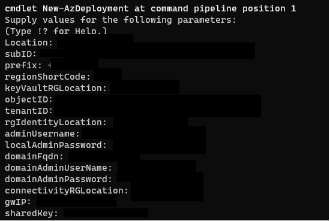

# Full lab deployment


What is currently deployed with the lab?

- [Full lab deployment](#full-lab-deployment)
  - [KeyVault](#keyvault)
  - [Active Directory](#active-directory)
  - [Connectivity](#connectivity)
  - [**Single File Deploy**](#single-file-deploy)

## [KeyVault](00-prereqs/keyVault/)

Added keyvault for stroing of secrets for later use, working on adding more and having creds available in a secure manner will be VERY miportant.

## [Active Directory](./01-adds/)

All deployed with [Bicep](https://docs.microsoft.com/en-us/azure/azure-resource-manager/templates/bicep-overview)  
Simply run this [file](./01-adds/deploy.ps1) and provide the rquired parameters.  

PowerShell

```powershell
## location to be deployed into
## resource group name to be created
$rgLocation = ""
$rgName = ""

## subscription id for Managed Identity
$subID = read-host "Please enter your Sub ID, used fo the managed identity."

## add tags if you want to add metadata
$tags = @{"Purpose"="Identity"; "Can Be Deleted"="no"}
#use this command when you need to create a new resource group for your deployment
$rg = New-AzResourceGroup -Name $rgName -Location $rgLocation 
New-AzTag -ResourceId $rg.ResourceId -Tag $tags

## Bicep File name
$bicepFile = ".\main.bicep"
$deploymentName = ($bicepFile).Substring(2) + "-" +(get-date -Format ddMMyyyy-hhmmss) + "-deployment"
New-AzResourceGroupDeployment -ResourceGroupName $rgName -TemplateFile $bicepFile -DeploymentName $deploymentName -rgName $rgName -subID $subID
```

## [Connectivity](./02-connectivity/)

This is the start of the native bicep components. This deploys all the requirements for Point-to-Site connectivity to be established. There is still some additional work you would need to do based upon the type of VPN connection you want to use. I, personally, use OpenVPN and these [instructions](https://www.getanadmin.com/azure/azure-point-to-site-vpn-setup-step-by-step/#:~:text=Azure%20Point%20to%20Site%20VPN%20Setup%20On%20the,case%2C%20the%20newly%20created%20Virtual%20Net%20Vnet3%20selected.), specifically for the certificate commands.

**Remember a Virtual Network Gateway will take some time to provision.**

## **[Single File Deploy](./allInOne.bicep)**

If you are looking to simply provide a bunch of parameters, have some coffee and looking for a full deployed file with all of the above components completed, use [this](./allInOneDeploy.ps1)



Components

- [Keyvault](./00-prereqs/keyVault/kv.bicep)
- [Secrets](00-prereqs/keyVault/secrets.bicep)
- [Virtual Network](./02-connectivity/p2sModules/network.bicep)
- [Public Ip](./02-connectivity/p2sModules/pip.bicep)
- [Virtual Network Gateway](./02-connectivity/p2sModules/vng.bicep)
- [Connection](./02-connectivity/s2sModules/connection.bicep)
- [Local Network Gateway](./02-connectivity/s2sModules/lng.bicep)
- [Identity Vnet](./02-connectivity/peeringModules/identityVnet.bicep)
- [Connectivity Vnet](./02-connectivity/peeringModules/connectivityVnet.bicep)
- [Peering from Connectivity to Identity](./02-connectivity/peeringModules/connectivity2idenityPeering.bicep)
- [Peering from Identity to Connectivity](./02-connectivity/peeringModules/identity2connectivityPeering.bicep)
